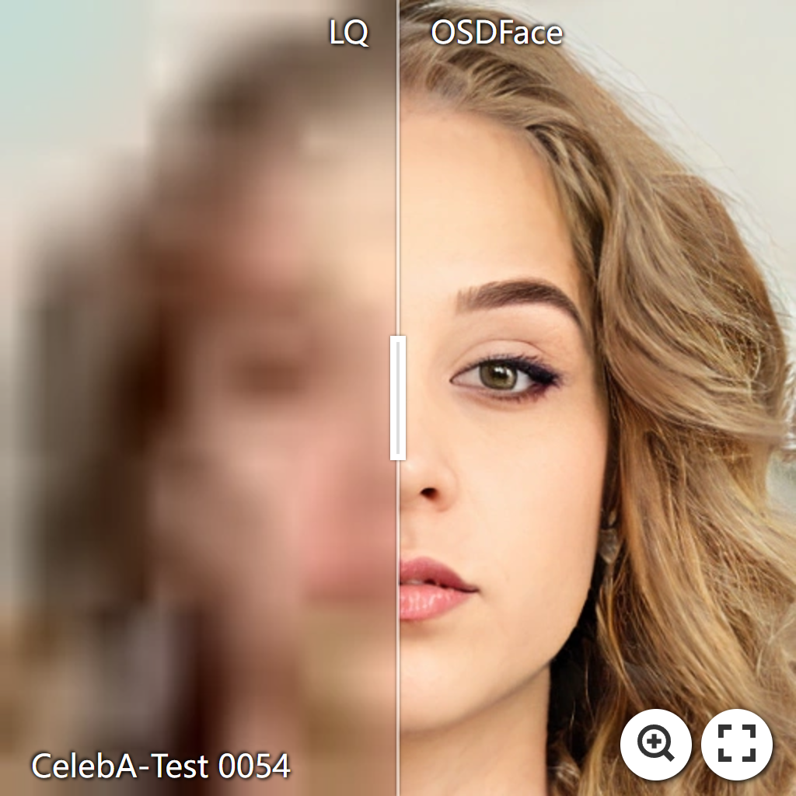

# OSDFace: One-Step Diffusion Model for Face Restoration

[Jingkai Wang](https://github.com/jkwang28), [Jue Gong](https://github.com/gobunu), [Lin Zhang](https://github.com/wanliyungui), [Zheng Chen](https://zhengchen1999.github.io/), Xing Liu, Hong Gu, [Yutong Liu](https://isabelleliu630.github.io/), [Yulun Zhang](http://yulunzhang.com/), and [Xiaokang Yang](https://scholar.google.com/citations?user=yDEavdMAAAAJ), "One-Step Diffusion Model for Face Restoration", CVPR, 2025

[](https://jkwang28.github.io/OSDFace-web/)
[](https://arxiv.org/abs/2411.17163)
[](https://github.com/jkwang28/OSDFace/releases/download/v2/supp.pdf)
[](https://github.com/jkwang28/OSDFace/releases)
[](https://github.com/jkwang28/OSDFace)
[](https://github.com/jkwang28/OSDFace)

#### 🔥🔥🔥 News

- **2025-04-23:** Results are released. (Synthetic dataset: CelebA-Test; Real-world datasets: Wider-Test, LFW-Test, and WebPhoto-Test)
- **2025-02-27:** Congratulations! OSDFace is accepted to CVPR 2025.
- **2024-11-25:** This repo is released.


---

> **Abstract:** Diffusion models have demonstrated impressive performance in face restoration. Yet, their multi-step inference process remains computationally intensive, limiting their applicability in real-world scenarios. Moreover, existing methods often struggle to generate face images that are harmonious, realistic, and consistent with the subject’s identity. In this work, we propose OSDFace, a novel one-step diffusion model for face restoration. Specifically, we propose a visual representation embedder (VRE) to better capture prior information and understand the input face. In VRE, low-quality faces are processed by a visual tokenizer and subsequently embedded with a vector-quantized dictionary to generate visual prompts. Additionally, we incorporate a facial identity loss derived from face recognition to further ensure identity consistency. We further employ a generative adversarial network (GAN) as a guidance model to encourage distribution alignment between the restored face and the ground truth. Experimental results demonstrate that OSDFace surpasses current state-of-the-art (SOTA) methods in both visual quality and quantitative metrics, generating high-fidelity, natural face images with high identity consistency.


---

<!--  -->

[](https://imgsli.com/MzIxNTU3) [](https://imgsli.com/MzIxNTU5) [](https://imgsli.com/MzIxNTYw) [](https://imgsli.com/MzIxNTYy)

[](https://imgsli.com/MzIxNTYz) [](https://imgsli.com/MzIxNTY4) [](https://imgsli.com/MzIxNTY5) [](https://imgsli.com/MzIxNTcz)

---

## ⚒️ TODO

* [ ] Release code and pretrained models

## 🔗 Contents

- [x] Datasets
- [ ] Models
- [ ] Testing
- [ ] Training
- [x] [Results](#Results)
- [x] [Citation](#Citation)
- [ ] [Acknowledgements](#Acknowledgements)

## <a name="datasets"></a>📊 Datasets

**Training Dataset:**

We use [FFHQ](https://github.com/NVlabs/ffhq-dataset) and [FFHQR](https://github.com/skylab-tech/ffhqr-dataset) for training. All of them are resized to 512x512. 

**Testing Dataset:**

We use CelebA-Test as the synthetic dataset. The download link can refer to [DAEFR](https://github.com/LIAGM/DAEFR). 

We use Wider-Test, LFW-Test, and WebPhoto-Test as the real-world datasets. The download links can refer to [DAEFR](https://github.com/LIAGM/DAEFR) and [VQFR](https://github.com/TencentARC/VQFR). 

Thanks a lot for their contribution to Face Restoration. 

## <a name="results"></a>🔎 Results

We achieved state-of-the-art performance on synthetic and real-world datasets. Detailed results can be found in the paper, and the full results could be downloaded here: [Google Drive](https://drive.google.com/file/d/1BQkh6mLGtmSSk0DvH_fpX2xx99UoSIcR/view?usp=sharing) or [OneDrive](https://sjtueducn-my.sharepoint.com/:u:/g/personal/jingkaiwang_sjtu_edu_cn/EWxudCoxhSVGng5FRawnzdYBhzROUfxCgBa2chUZFYfYkQ?e=yISwFp). 

<details>
<summary>&ensp;Quantitative Comparisons (click to expand) </summary>
<li> Results in Table 1 on synthetic dataset (CelebA-Test) from the main paper. 
<p align="center">

</p>
</li>
<li> Results in Table 2 on real-world datasets (Wider-Test, LFW-Test, WebPhoto-Test) from the main paper. 
<p align="center">

</p>
</li>
</details>
<details open>
<summary>&ensp;Visual Comparisons (click to expand) </summary>
<li> Results in Figure 5 on synthetic dataset (CelebA-Test) from the main paper.
<p align="center">

</p>
</li>
<li> Results in Figure 6 on real-world dataset (Wider-Test, LFW-Test, WebPhoto-Test) from the main paper.
<p align="center">

</p>
</li>
</details>
<details>
<summary style="margin-left: 2rem;">&ensp;More Comparisons on Synthetic Dataset... </summary>
<li style="margin-left: 2rem;"> Results in Figure 4, 5, 6 on synthetic dataset (CelebA-Test) from supplemental material.
<p align="center">

</p>
<p align="center">

</p>
<p align="center">

</p>
</li>
</details>
<details>
<summary style="margin-left: 2rem;">&ensp;More Comparisons on Real-World Dataset... </summary>
<li style="margin-left: 2rem;"> Results in Figure 7, 8, 9, 10 on real-world datasets (Wider-Test, LFW-Test, WebPhoto-Test) from supplemental material.
<p align="center">

</p>
<p align="center">

</p>
<p align="center">

</p>
<p align="center">

</p>
</li>
</details>

## <a name="citation"></a>📎 Citation

If you find the code helpful in your research or work, please cite the following paper(s).

```
@InProceedings{wang2025osdface,
    author    = {Wang, Jingkai and Gong, Jue and Zhang, Lin and Chen, Zheng and Liu, Xing and Gu, Hong and Liu, Yutong and Zhang, Yulun and Yang, Xiaokang},
    title     = {{OSDFace}: One-Step Diffusion Model for Face Restoration},
    booktitle = {Proceedings of the Computer Vision and Pattern Recognition Conference (CVPR)},
    month     = {June},
    year      = {2025},
    pages     = {12626-12636}
}
```

## <a name="acknowledgements"></a>💡 Acknowledgements

[TBD]

<!--  -->
